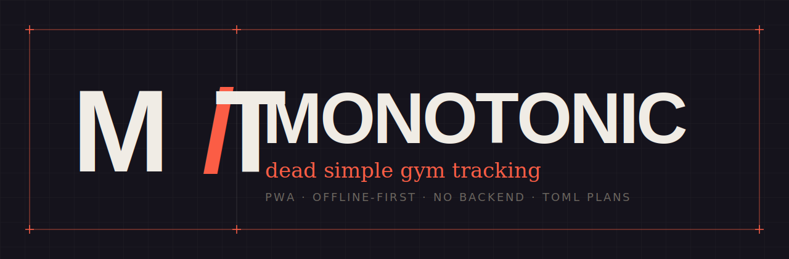
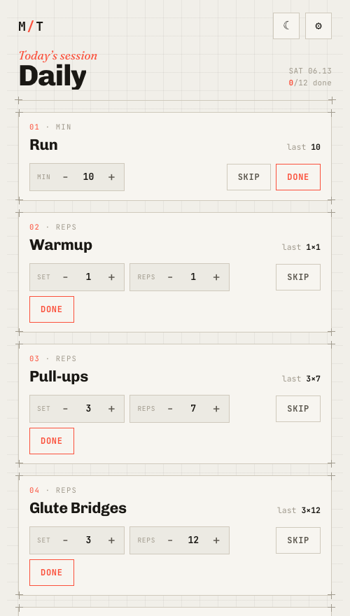
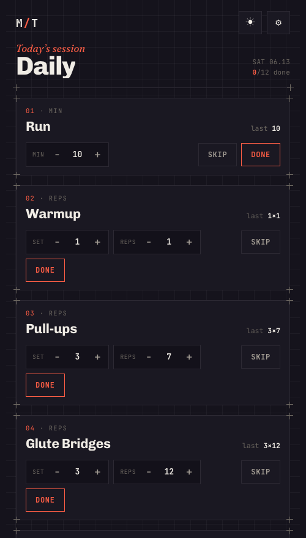

<p align="center">
  
</p>

<h1 align="center">Monotonic</h1>

<p align="center">
  
  
  
  
  
</p>

A phone-first gym session tracker. Open it and today's workout is right there — no
login, no loading, no menus. Each exercise shows **what you did last time**, and the
only goal is to keep the numbers the same or higher. No history, no charts, no streaks
— just up.

It's an offline-first PWA (a single set of static files), so it installs to your home
screen, works with no signal at the gym, and needs no backend or app store.

---

## Getting started

<p align="center">
  <a href="https://tetigi.github.io/monotonic/">
    
  </a>
</p>

<p align="center">
  
  &nbsp;&nbsp;
  
</p>

You don't need to fork or host anything — just use the deployed app:

1. **Add to your phone.** Open the link above in **Safari** (iOS) → Share → **Add to
   Home Screen**. It launches full-screen, offline-capable, straight to today's session.
2. **Point it at your plans.** Put your TOML in a [GitHub gist](https://gist.github.com),
   copy its **raw** URL, and paste it into the app's ⚙ settings. Edit the gist anytime —
   no redeploy.

Want your own copy? Fork it and enable **Settings → Pages → Deploy from `main` / root**;
your app lives at `https://<you>.github.io/monotonic/`.

---

## What it does

- **Opens to today's session.** Plans are tagged with the day(s) they apply to; the
  app auto-selects today's.
- **Touch-first.** Big `−`/`+` steppers for sets, reps, and weight — no keyboard during
  a workout (tap a number for manual entry).
- **Monotonic cue.** Each card shows `last 3×8 · 70`. Beat it → coral (**ahead**); drop
  below → amber (**behind**).
- **Done / Skip.** "Done" records your numbers as the new reference; "Skip" leaves them.
- **Resumes mid-workout, resets daily.** Reopen the same day and your ticks are still
  there; a new day starts fresh, pre-filled with last time's numbers.
- **Light / dark theme** and **works offline.**

## How progress works

- Your **plan** (the TOML) sets the exercises, their order, and the starting numbers the
  first time you do each one.
- After that, your **last completed numbers** become the reference on screen — the thing
  you keep ≥. Stored locally, keyed by exercise name. "Done" advances it; "Skip" doesn't.

---

## Writing your workout (TOML)

Plans live in a TOML file the app fetches from a URL you control (or the bundled
[`plans.toml`](plans.toml)). One file holds all your plans.

```toml
[[plan]]
name = "Daily"
days = ["mon", "tue", "wed", "thu", "fri", "sat", "sun"]   # when it applies

  [[plan.exercise]]
  name = "Run"
  sets = 1
  reps = 10
  unit = "min"            # show as minutes

  [[plan.exercise]]
  name = "Wall Sits"
  sets = 3
  reps = 60
  unit = "time"           # show mm:ss (reps = seconds); +/- 15s

  [[plan.exercise]]
  name = "Deadlift"
  sets = 3
  reps = 8
  weight = 70             # omit for bodyweight (hides the weight stepper)
  weight_step = 2.5       # +/- increment for weight (default 2.5)
```

**Per-exercise fields**

| Field         | Required | Meaning |
|---------------|----------|---------|
| `name`        | yes      | Exercise label (also its identity for tracking progress). |
| `sets`        | yes      | Number of sets. The sets stepper is hidden for single-set, non-rep moves (e.g. a run). |
| `reps`        | yes      | Reps — or, with `unit`, minutes / seconds (see below). |
| `weight`      | no       | Weight; omit for bodyweight. |
| `weight_step` | no       | Weight `+/-` increment. Default `2.5`. |
| `unit`        | no       | `reps` (default), `min` (whole minutes), or `time` (mm:ss, with `reps` given in **seconds**). |
| `rep_step`    | no       | `+/-` increment for the middle field. Default `1`, or `15` for `unit = "time"`. |

**Plan fields:** `name`, `days` (any of `mon`…`sun` or full names, case-insensitive),
and an ordered list of `[[plan.exercise]]`. Renaming an exercise starts its progress
fresh (identity is the name).

## Settings (⚙)

- **Plans URL** — where to fetch TOML (blank = bundled `plans.toml`).
- **Refresh** — re-fetch plans now.
- **Restart session** — wipe today's ticks and rebuild from last numbers.
- **Export / Import** — download or restore a JSON backup of your progress (the only
  irreplaceable, device-local data).

---

## Development

No build step — vanilla ES modules and static files.

```bash
python3 -m http.server 8000      # serve, then open http://localhost:8000
node --test                      # run the unit tests (11)
uv run --with pillow scripts/make_icons.py   # regenerate icons
```

| Path | What |
|------|------|
| `index.html` | Markup + all CSS (themes, responsive, styling). |
| `app.js` | UI: rendering, steppers, done/skip, theme, settings, fetch/cache. |
| `core.js` | Pure, DOM-free logic (TOML parse, day selection, monotonic cue) — unit-tested. |
| `vendor/toml.js` | Vendored [`smol-toml`](https://github.com/squirrelchat/smol-toml) parser. |
| `sw.js` | Service worker: network-first shell + runtime font cache. |
| `plans.toml` | Default/example workout. |

Progress, settings, and the active session live in `localStorage`; the service worker
is network-first, so pushes show up on the next online open (close and reopen the
installed app once for a new worker to take over).

## Credits

Shamelessly **vibe-coded** with Claude Code. Visual language borrowed from
[hex.tech](https://hex.tech).

Type: [Chivo](https://fonts.google.com/specimen/Chivo),
[JetBrains Mono](https://fonts.google.com/specimen/JetBrains+Mono),
[Fraunces](https://fonts.google.com/specimen/Fraunces).
TOML parsing by [smol-toml](https://github.com/squirrelchat/smol-toml).
